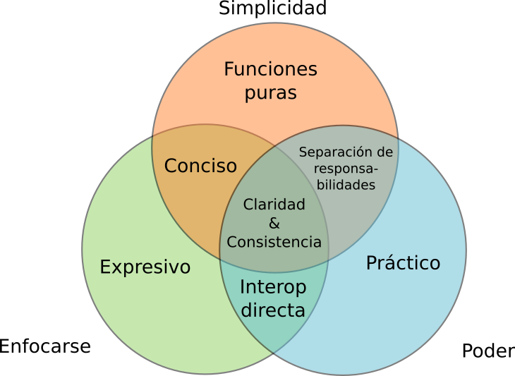

# Características #

* Simplicidad
* Alojado (JVM, Javascript, CLR)
* Ágil
* Funcional




## Simplicidad ##

Complejidad incidental
Complejidad esencial

Clojure hace posible tomar problemas complicados sin agregar demasiada complejidad
Provee herramientas para reducir la complejidad esencial

Creado bajo la premisa de proveer un conjunto de abstracciones simples (pocas partes ortogonales) y bloques que se puedan ensamblar para taclear problemas más complicados.

Ejemplo de complejidad incidental en lenguajes OO: todo código útil está sepultado en varias capas de clases, herencia y declaraciones de tipos. En clojure preferimos las _funciones puras_, toma algunos argumentos y produce un resultado basado en exclusivamente en dichos argumentos.

Clojure mantiene las cosas simples:

* Evita un ciclo de compila-y-ejecuta
* Facilita la exploración de ideas
* Es dinámico (no requiere declarar tipos)
* Permite modificar el lenguaje para adecuarse a cada dominio

## Poder ##

Clojure no es un lenguaje diseñado para ejemplificar ideas académicas o explorar ciertos modelos computacionales. Es un lenguaje práctico, cuyo valor se demuestra de acuerdo a cuantas aplicaciones útiles e interesantes permite escribir.

Si en algún momento durante el diseño de clojure se presentó una disyuntiva entre una solución práctica o una solución elegante, inteligente, etc. la mayoría de las veces ganó la solución práctica (e.g. interop).


## Claridad ##

```python
 x = [5]
 process(x)
 x[0] = x[0] + 1
```

 Después de ejecutar este código. ¿Cuál es el valor de x? Depende...

 * ¿Qué hace `process`?
 * ¿Hay varios hilos de ejecución? ¿Se garantizan escrituras atómicas?

Clojure separa distintas responsabilidades para evitar confundir y mezclar todo esto (para el ejemplo anterior: variables locales inmutables y colecciones persistentes)


 | Mezclado                                        | Separa                                     |
 | ----------------------------------------------- | ------------------------------------------ |
 | Objetos con campos mutables                     | Valores de identidades                     |
 | Una clase es un espacio de nombres para métodos | Espacios de nombres de tipos               |
 | Herencia mediantes clases                       | Jerarquía de nombres de datos y funciones  |
 | Datos y métodos léxicamente juntos              | Representación de información de funciones |


## Consistencia ##

### Consistencia de sintaxis ###

Conceptos similares deben contar con una forma similar. Primer ejemplo: vectores para asociar valores con nombres:

```clojure
[nombre-1 valor-1
 nombre-2 valor-2
 ,,,]
```

Siempre que se tiene una expresión que asocia nombres para algo, se hace de esa forma.

Otro ejemplo serían `for` y `doseq`. El primero permite crear una secuencia, mientras que el segundo recorre una secuencia para obtener efectos secundarios. Ambos tiene el mismo minilenguaje para iterar cosas: destructuring y guardias `when`y `while`.

```clojure
(for [x [:a :b],
      y (range 5) :when (odd? y)]
[x y])
;;=> ([:a 1] [:a 3] [:b 1] [:b 3])
```

```clojure
(doseq [x [:a :b],
        y (range 5) :when (odd? y)]
(prn x y))
; :a 1
; :a 3
; :b 1
; :b 3
;;=> nil
```

### Consistencia en estructuras de datos ###

Sin importar el tipo específico de una estructura de datos, es deseable contar con una forma similar de trabajar con todas ellas.

```
"It is better to have 100 functions operate on one data structure than to have 10 functions operate on 10 data structures."

-- Alan Perlis
```

Es mejor que esas 100 funciones trabajen sobre una abstracción (secuencia).

Aunado a esto, clojure es un Lisp, una familia de lenguajes donde la filosofía clásica es 'código son datos'. Esto hace que las mismas estructuras de datos de clojure no solo se utilizan para guardar información, también representan partes de la aplicación misma.

Por ejemplo, mediante `hiccup` podemos escribir este html:

```html
<head>
   <script src="myscript.js" type="text/javascript"></script>
   <link href="mystyle.css" rel="stylesheet" type="text/css"/>
</head>

<body>
  <div>
    <h1 class="info">Hiccup</h1>
  </div>
</body>
```

Con esta función y vectores:

```clojure
(html
  [:head (include-js "myscript.js") (include-css "mystyle.css")]
  [:body [:div [:h1 {:class "info"} "Hiccup"]]])
```

O una función para construir un listado de elementos:

```clojure
(defn usuarios [sección usuarios]
  [:div
   [:h3 sección]
   [:ul
    (for [usuario usuarios :when (:activo usuario)]
      [:li.tarjeta (:nombre usuario)])]])
```

Y la llamada:

```clojure
(usuarios "Usuarios activos"
            [{:nombre "Joe"
              :activo true}
             {:nombre "Erich"
              :activo false}
             {:nombre "Matthias"
              :activo true}])
```

Generaría el siguiente html:

```html
<div>
  <h3>Usuarios activos</h3>
  <ul>
    <li class="tarjeta">Joe</li>
    <li class="tarjeta">Matthias</li>
  </ul>
</div>
```


# Recursos #

https://clojure.org/about/rationale
